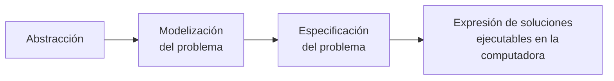
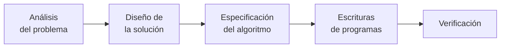
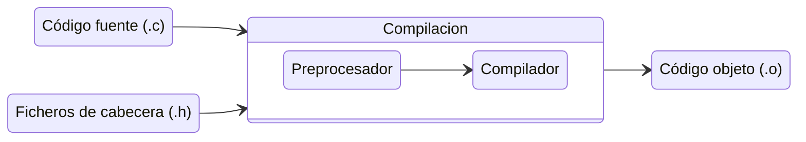

# programación - 2023

<details open>
  <summary>
    <h2>Tabla de contenidos</h2>
  </summary>

0. [Unidad 0 - algoritmos](#algoritmos)
1. [Unidad 1 - programación](#programación)
   - [Proceso de programación](#el-proceso-de-programación)
   - [Etapas en la resolución de problemas con computadora](#etapas-de-resolución-de-problemas)
2. [Unidad 2 - lenguajes de programación](#lenguajes-de-programación)
   - [Lenguaje de programación](#lenguaje-de-programación)
   - [Programación estructurada](#la-programación-estructurada)
   - [El lenguaje C](#lenguaje-c)
   - [Elementos básicos de un programa](#en-un-programa-intervienen)
   - [Acerca del compilador](#compilador)
   - [Etapas de compilación](#etapas-de-compilación)
3. [Unidad 3 - tipos de datos](#tipos-de-datos)
   - [Tipos de Datos Simples](#tipos-de-datos-simples)
   - [Entradas y salidas básicas](#entradas-y-salidas-básicas)
   - [Tipo de dato entero](#tipos-de-dato-entero-tamaño-calificadores)
   - [Tipo de dato float](#tipos-de-dato-float-y-double-tamaño-calificadores)
   - [Operadores](#operadores)
   - [Estructura de selección](#estructura-de-selección)
   - [Estructuras de control iterativas](#estructuras-iterativas)
4. [Unidad 4 - Diseño modular](#diseño-modular)
   - [Tipos de Funciones](#tipos-de-funciones)
   - [De modulo a función](#de-módulo-a-función)
   - [Sintaxis de funciones](#sintxis-para-definir-una-función)
   - [Consideraciones](#a-tener-en-cuenta)
   - [Prototipo de una función](#prototipo-de-una-función)
   - [Funciones de biblioteca](#funciones-de-biblioteca)
5. [Unidad 5 - Tipos de datos derivados](#tipos-de-datos-derivados)
   - [Arreglos](#arreglos)
   - [Arreglos de una dimensión](#arreglos-de-una-dimensión)
   - [Inicialización de arreglos](#inicialización-de-arreglos)
   - [Arreglo de más de una dimensión](#arreglo-de-más-de-una-dimensión)
   - [Cadenas - Arreglos de caracteres](#cadenas---arreglos-de-caracteres)
   - [Funciones](#funciones-de-biblioteca-stringh)
</details>

## Algoritmos

### ¿Qué es un algoritmo?

Un algoritmo es una descripción de la forma en la que se debe llevar a cabo una tarea o proceso, tiene una serie finita de pasos (Un comienzo y un fin).

El diseño del algoritmo se realiza usando PSEUDOCÓDIGO.

- Neutro: Es independiente al lenguaje a utilizar.
- Completo: Permite expresar cualquier idea computacional.

### Características del pseudocódigo

Cada algoritmo tiene:

- Un nombre que indica la tarea que resolverá
- Puede tener o no una entrada (Datos que necesitamos que el usuario ingrese)
- Tiene una salida (Datos que devuelve nuestro programa)
- Toda entrada se debe **LEER**. (Todos los datos "ingresados" por los usuarios se deben leer)
- Se puede asignar valores a las variables.
- Toda salida se debe **ESCRBIR**: (Todos los datos que obtenemos se deben "mostrar")
  \*Para indicar el final de un algoritmo, utilizamos **PARAR**

### Técnicas de diseño de algoritmos

- El proceso de adicionar más detalles a una solución de un problema se conoce como **REFINAMIENTO SUCESIVO.**

- El método **DIVIDE AND CONQUER** con la que se aborda un problema tiene la característica de ser una técnica **TOP-DOWN**. (Es una estrategia que permite descomponer un problema largo y complejo en subproblemas mas pequeños y fáciles de resolver).

#### Ejemplo 1:

La modalidad de pago de la factura de luz en una cierta ciudad es la siguiente: se establece una tarifa mensual para el consumo mínimo (hasta los 100 kwh) de $1200. Si se ha sobrepasado dicho consumo, se suma una tarifa de $125 por cada kwh adicional; pero si está vencida la factura, la tarifa que se usa ya no es de $125 sino de $210. Además en cualquier caso se hace un descuento del 5% al monto total, por pago de contado. Diseñe un algoritmo con niveles de refinamiento, que determine cuánto debe pagar cada cliente. Pruebe la misma para un número indefinido de clientes.

```
ALGORITMO: PAGO_LUZ
ENTRADAS:
  consumo: real,
  estaVencida: entero (0: no / 1: si),
  cliente: entero positivo,
  metodoDePago: entero (0: tarjeta / 1: contado),

SALIDA:
  importe: real

VAR. AUXILAR:
  excede: real

A1. LEER (cliente)
A2. calcular_importe
A3. PARAR
```

```
A2. calcular_importe
  MIENTRAS (cliente > 0)
    LEER(consumo, metodoDePago, estaVencida)

    SI (consumo <= 100) ENTONCES
      importe <- 1200
    SINO
      excede <- consumo - 100
      SI (estaVencida = 1) ENTONCES
        importe<- 1200 + excede * 210
      SINO
        importe<- 1200 + excede * 125
      FIN SI
    FIN SI

    SI (metodoDePago = 1) ENTONCES
      importe <- importe - (importe * 0.05)
    FIN SI

    ESCRIBIR (importe)
    LEER (cliente)
  FIN MIENTRAS
```

**[⬆ Volver arriba](#tabla-de-contenidos)**

## Programación

### El proceso de programación

- ¿Como se resuelve un problema del mundo real con una computadora?

- ¿Como se expresa la solución al problema planteado?

- ¿Como se reduce la complejidad de los problemas?

El programador debe realizar algunos procesos intelectuales.



#### Abstracción

Interpretar los aspectos esenciales de un problema y expresarlo en términos **precisos**.

#### Modelización del problema

Simplificar su expresión encontrando sus aspectos principales, los datos que se deben procesar y el contexto.

#### Especificación del problema real

Se deben determinar en forma clara y concreta el objetivo que se desea.

Por ejemplo el Algoritmo de la [unidad 0](#ejemplo-1)

```
ALGORITMO: PAGO_LUZ
ENTRADAS:
  consumo: real,
  estaVencida: entero (0: no / 1: si),
  cliente: entero positivo,
  metodoDePago: entero (0: tarjeta / 1: contado),

SALIDA:
  importe: real

VAR. AUXILAR:
  excede: real

A1. LEER (cliente)
A2. calcular_importe
A3. PARAR
```

```
A2. calcular_importe
  MIENTRAS (cliente > 0)
    LEER(consumo, metodoDePago, estaVencida)

    SI (consumo <= 100) ENTONCES
      importe <- 1200
    SINO
      excede <- consumo - 100
      SI (estaVencida = 1) ENTONCES
        importe<- 1200 + excede * 210
      SINO
        importe<- 1200 + excede * 125
      FIN SI
    FIN SI

    SI (metodoDePago = 1) ENTONCES
      importe <- importe - (importe * 0.05)
    FIN SI

    ESCRIBIR (importe)
    LEER (cliente)
  FIN MIENTRAS
```

#### Expresión de soluciones ejecutables en la PC

Realizar una solución ejecutable en una computadora usando un lenguaje de programación.

```C
/** Aqui se colocará la solución en lenguaje C*/
#include <stdio.h>

int main()
{

  return 0
}
```

**[⬆ Volver arriba](#tabla-de-contenidos)**

### Etapas de resolución de problemas



#### Análisis del problema

##### La importancia del contexto:

La definición del contexto es importante para analizar y diseñar la solución usando computadoras.

Impone restricciones y consideraciones.

#### Diseño de la solución

##### Descomposición - Modularización:

Se usará la metodología top-down (arriba-abajo) de descomposición de problemas para desarrollar el sistema de software.

Se obtendrán módulos que deberán estar ligados entre si para obtener la solución final.

#### Especificación del algoritmo

- Cada uno de los módulos deberá tener su propio algoritmo.

- La elección del algoritmo es importante, dado que de ella depende la eficiencia de la solución.

#### Escritura de programas

Un algoritmo es una especificación simbólica que debe convertirse a programa real sobre un lenguaje de programación concreto. (Ya sea C, python, JavaScript, etc.)

Programar no es lo mismo que codificar. La programación se trata de desarrollar una aplicación o máquina completa; mientras que la codificación trata de **traducir** un lenguaje a uno que una máquina pueda entender.

#### Verificación

Antes de dar por finalizada cualquier labor de programación, es fundamental preparar un conjunto de datos representativos del problema que permiten probar el programa cuando se ejecute, y así verificar los resultados. Para esto se realizan:

- Pruebas (testing)
- Depuración
- Alternativas de diseño y estilo.

> **Importante! :** Cuanto mas exhaustivas sean las pruebas, mayor seguridad se tendrá que el funcionamiento del programa es correcto, por lo tanto menor posibilidad de errores.

##### Verificación: Corrección, prueba y optimización

- **Los errores de ejecución:** Afectan la operación normal del programa. Son originados por el usuario (Proporcionar datos incorrectos, formato diferente al esperado, etc).

- **Errores de tipo logico:** Derivan de un mal diseño de los algoritmos, como ser: bucle infinito, resultados incorrectos, etc.

- **Errores de sintaxis:** Se generan por no cumplicar con las "normas" de escritura de un lenguaje, como ser: falta o mal uso de elementos separadores (comas(,), puntos y comas ';') o incluso palabras mal escritas.

#### Documentación

Documentación interna:

- Tabulación en el código.
- Uso de los comentarios.

Documentación externa:

- Para el usuario.
- Para el programador.

### Conclusión

Un programador debe asociar inmediatamente el proceso de desarrollo de software con el proceso de refinamiento y abstracción que abarca desde el problema real hasta su solución algorítmica con un lenguaje de programación

**[⬆ Volver arriba](#tabla-de-contenidos)**

## Lenguajes de programación

### Definición de lenguaje

Es el sistema a través del cual el hombre comunica sus ideas, sentimientos, ya sea a través del habla, la escritura u otros signos.

### Lenguaje de programación

Un **Lenguaje de programación** es un lenguaje formal que proporciona una serie de instrucciones que permiten a un programador escribir secuencias de órdenes y algoritmos a modo de poder controlar el comportamiento físico y loógico de una computadora.

A todo este conjunto de órdenes y datos escritos mediante un lenguaje de programación, se le conoce como programa.

**[⬆ Volver arriba](#tabla-de-contenidos)**

### Tipos de lenguajes

La máquina sólo entiende un lenguaje conocido como código binario o código máquina, consiste en ceros y unos. Es decir solo utiliza 0 y 1 para codificar cualquier acción.

**Existen dos tipos de lenguajes claramente diferenciados:**

- **Lenguaje de bajo nivel:** Son los más próximos a la arquitectura hardware.

- **Lenguaje de alto nivel:** Son aquellos que se encuentran más cercanos a los programadores y usuarios.

#### Lenguajes de bajo nivel 🤿:

Son lenguajes totalmente dependientes de la máquina, es decir que el programa que se realiza con este tipo de _lenguajes no se pueden migrar o utilizar en otras maquinas_.

Al estar prácticamente diseñados a medida del hardware, aprovechan al máximo las características del mismo.

Dentro de los lenguajes de bajo nivel se encuentran **El lenguaje maquina**, que consiste en combinaciones de 0's y 1;s para formar ordenes entendibles por el hardware de la máquina. Son mucho más rápidos, pero dificiles de manejar.

Por otro lado se encuentra el _Lenguaje ensamblador_, el cual es un derivado del lenguaje maquina y está formado por abreviaturas de letras y números llamados mnemotécnicos. Como ventaja respecto al código máquina es que los códigos fuentes son más cortos y los programas ocupan menos memoria. Pero al igual que antes, son dificiles de probar y mantener.

#### Lenguajes de alto nivel 🗻:

Son aquellos que se encuentran más cercanos al lenguaje natural que al lenguaje máquina. **_Se tratan de lenguajes independientes de la arquitectura del ordenador._** Por lo que un programa escrito en lenguajes de alto nivel se pueden migrar entre máquinas sin ningún problema.

También permiten al programador olvidarse del funcionamiento interno de la máquina, dado que solo necesitan un "traductor" que entienda el código fuente como las características de la máquina.

#### ¿Podemos llamar HTML como lenguaje de programación?

La respuesta es un retundo NO.

HTML es un lenguaje de etiquetas (tag) que comunican al navegador cuál es la información a mostrar por pantalla.

**[⬆ Volver arriba](#tabla-de-contenidos)**

### La programación estructurada

Es un paradigma de programación orientado a mejorar la claridad, calidad y tiempo de desarrollo de un programa de computadora.

Propone segregar los procesos en estructuras elementales:

- Secuencia
- Selección
- Iteración

**[⬆ Volver arriba](#tabla-de-contenidos)**

### Lenguaje C

Los laboratorios Bell lo desarrollaron a principios de la decada del 70.
Los autores son Brian Kernighan y Dennis Ritchie.

El objetivo de su creación fue para que los programadores de Bell pudieran redactar su sitema operativo UNIX para una nueva computadora.

Debido a que los otros lenguajes de alto nivel existentes en aquel tiempo (COBOL, FORTRAN, etc), eran demasiados lentos para ser utilizados en la codificación de un sistema operativo. Los programadores de laboratorios Bell decidieron desarrolla su propio lenguaje, basado en Algol y BCPL, dos eficientes lenguajes de alto nivel.

#### Características de C

- Es un lenguaje para la programación estructurada
- Es tipificado
- Contiene muy pocas palabras reservadas
- No contiene órdenes para trabajar con objetos compuestos (cadenas, registros, etc)
- Distingue entre mayúsculas y minúsculas

#### Ventajas

- Es el lenguaje más portado en la existencia, habiendo compiladores para casi todos los sistemas conocidos.
- Proporciona facilidades para realizar programas modulares y/o utilizar código o bibliotecas existentes.
- Lenguaje flexible, veloz y potente.
- Posibilita programación estructurada o modular.
- Acceso a memoria de bajo nivel mediante el uso de punteros.

#### Desventajas

- No tiene instrucciones propias para la asignación dinámica de memoria, ni instrucciones de entrada/salida.
- Se requiere más tiempo en conseguir el ejecutable, por que cada vez se compila todo el fichero.
- No dispone de sistemas de control automáticos y la seguridad depende casi exclusivamente de la experiencia del programador.

**[⬆ Volver arriba](#tabla-de-contenidos)**

### En un programa intervienen

- Ordenes para el preprocesador
- Variables
- Constantes
- Aritmética
- Funciones
- Funciones de entrada y salida
- Comentarios

#### Ordenes para el preprocesador

Conceptualmente es un paso previo a la compilación, las pasa usadas son:
`#include`, `#define`. Se utiliza para inclusión de archivos.



#### Funciones

**_Un programa escrito en código C es una reunión de funciones._**

**main**: Función principal, debe estar presente en todos los programas escritos en C. Puede invocar a otras funciones.

- Un método para comunicar datos entre las funciones, es a través de argumentos.
- Las paréntesis después del nombre, están para encerraar una lista de valores que serán argumentos.
- Puede ocurrir que una función esté definida para no esperar argumentos.

#### Funciones de entrada y salida

La biblioteca stándar `stdio.h` provee al programador una extensa gama de funciones para lectura y escritura. Es necesario escribir una orden para el preprocesador para usar dichas funciones.

```C
#include <stdio.h>

int main()
{
  int num;
  printf("Ingrese un numero");
  scanf("%d", &num);
  printf("El numero ingresado fue %d", num);

  return 0;
}
```

#### Variables y constantes

- Son objetos sobre los que actúan las instrucciones que componen el programa.
- Deben ser declaradas.
- Deben tener un identificador asociado.
- El 1º caracter debe ser una letra.
- Debe indicarse el tipo de dato.
- Las variables pueden inicializarse de forma grupal.
- Las constantes se definen en una línea `#define`, que es una directiva del preprocesador.

  Por ej: `#define MAX 100`

- Las constantes pueden ser enteras, reales y de carácter.

#### Aritmética

- Interacción entre los operadores aritméticos y las variables y/o constantes declaradas (si el tipo es numérico).
- El tipo de operación permitido está ligado con el _tipo de dato_ con que fue declarada la variable y/o constante.
- Tipos de datos básicos: `int`,`float`,`char`,`short`,`long`,`double`.

#### Comentarios

Dos modos de comentar las acciones del código escrito:

```C
// Comentarios de una sola línea

/* Comentarios
  de varias
  lineas
*/
```

**[⬆ Volver arriba](#tabla-de-contenidos)**

### Compilador

El compilador para C del proyecto GNU se llama "gcc" y su nombre proviene de "GNU C Compiler" (O GNU Collection Compiler).

Un compilador, es un programa informático que traduce un programa de un lenguaje a otro, generando un lenguaje equivalente que la máquina será capaz de interpretar.

Este proceso de traducción se conoce como compilación.

### Código Fuente

El compilador gcc es capaz de compilar cualquier programa en lenguaje C, escrito en un archivo de texto convencional. Este archivo lleva el sufijo ".c" para identificar que su contenido corresponde al código de un programa escrito en lenguaje C.

Actualmente existen herramientas más especificas para escribir y editar código fuente de manera más eficaz que un simple editor de texto.

**[⬆ Volver arriba](#tabla-de-contenidos)**

### Compilando un programa en C

```bash
gcc -Wall holaMundo.c -o holaMundo
```

El comando anterior compila el código fuente a código máquina y lo almacena en archivo ejecutable.

**_-Wall:_** Opción para activar las advertencias del compilador.

**_-o:_** Permite especificar el archivo de salida. Si este se omite, se crea uno por defecto 'a.exe'.

**_holaMundo.c:_** nombre del archivo fuente

**_holaMundo:_** nombre del archivo fuente

### Etapas de compilación

Cuando invocamos el comando `gcc`, normalmente se realizan los un **preprocesamiento**, **compilación**, **ensamblado** y **enlazado**.

Cada etapa tiene un código fuente como entrada y un código objeto como resultado. El codigo de las etapas intermedias sirve de fuente para la siguiente. Para las etapas, utilizaremso el siguiente ejemplo

#### Ejemplo 2:

```C
/** circulo.c */
#include <stdio.h>
#define PI 3.1416

int main()
{
  float area, radio;
  printf("Ingresar el radio del circulo: ");
  scanf("%f", &radio);
  area = PI * (radio * radio);
  printf("Area del circulo = %.2f", area);

  return 0
}
```

#### Preprocesamiento

Es realizado por el preprocesador. Esta primera etapa traduce el archivo fuente que es una forma apliada del lenguaje.

```sh
gcc -E circulo.c -o circulo.i
```

Luego del preprocesamiento, es posible ver en el archivo _circulo.i_, que la constante simbólica **PI**, definida con la directiva del preprocesador `#define`, es sustituida por su valor en todos los lugares donde aparece.

En esta etapa, se resuelven todas las directivas del preprocesador que aparezcan en el código fuente.

##### Opciones que se usaron para preprocesar el archivo de código fuente:

- **-E:** Opción para detener el proceso de compilación luego de realizado el preprocesamiento. La salida es en la forma de un archivo preprocesado. Los archivos que no requieren preprocesamiento son ignorados.
- **-o:** Opción para especificar el archivo de salida.
- **circulo.c:** Nombre del archivo de entrada a ser preprocesado.
- **circulo.i::** Nombre del archivo de salida. Se utiliza el sufijo _".i"_ para identificar a los archivos preprocesados.

#### Compilación

La compilación transforma el código C preprocesado en el lenguaje ensamblador propio del procesador de nuestra máquina.

```sh
gcc -S circulo.c
```

Con este comando se realizan las dos primeras etapas y se crea un archivo _"circulo.s"_.

- **-S:** Opción para detener luego de realizada la etapa de compilación, no realiza la etapa de ensamblado. La salida es en forma de código _assembly_.
- **circulo.c:** Nombre del archivo de entrada para ser compilado.

#### Ensamblado

Se traduce el programa escrito en lenguaje _assembly_, de la etapa anterior, a código binario en lenguaje de maquina entendible por el procesador.

```sh
gcc -c circulo.c
```

Con este comando se realizan las tres primeras etapas, creando el archivo _"circulo.o"_. Este archivo contiene código binario listo para ser enlazado en la próxima etapa.

- **-c:** Opción para detener luego de realizada la etapa de ensamblado.

#### Enlazado

Las funciones como `printf`, se encuentran compiladas y ensambladas en librerías existentes. Para que el archivo resultado del proceso de compilación completo sea ejecutable, es necesario incorporar el código binario de estas funciones en el lenguaje final.

```sh
gcc circulo.c -o circulo
```

Esta es la línea de comando que comúnmente se usará al compilar un archivo en C para obtener un archivo ejecutable.

**[⬆ Volver arriba](#tabla-de-contenidos)**

## Tipos de Datos

- Los lenguajes de alto nivel permiten hacer abstracciones e ignorar los detalles de la representación interna (propios de la máquina), usando el concepto de **_tipos de datos._**

  Así la información almacenada en memoria no es tratada como una secuencia de bits, si no, como valores enteros, reales, carácter, etc.

- Podemos clasificarlos en dos grandes grupos: datos simples y compuestos.

### Tipos de Datos Simples

Los especificadores de tipo de dato, determinan el tipo de dato o elemento de información que contendrá _el área de memoria reservada para las variables declaradas_ por medio de la declaración en proceso.

| Tipo                           | Palabra reservada |
| :----------------------------- | :---------------: |
| Carácter                       |       char        |
| Entero de longitud estándar    |        int        |
| Entero de longitud grande      |     long int      |
| Entero de longitud pequeña     |     short int     |
| Entero sin signo               |     unsigned      |
| Punto flotante (real)          |       float       |
| Punto flotante doble precisión |      double       |

#### Variables

Una variable es un objeto cuyo valor cambia durante la ejecución del programa. Tiene un _nombre_ y ocupa una cierta _posición de memoria_.

**_Todas las variables que se usan deben ser declaradas._** La declaración de la misma, se hace usando una **palabra reservada** del lenguaje. Por ejemplo, **int** es la palabra reservada que le avisa al compilador que la variable con la que se va a trabajar es de tipo entero.

Una palabra reservada es una palabra con significado especifico, predefinido por el lenguaje que se usará.

#### Constantes simbólicas

Una forma de evitar el uso de _"números mágicos"_, que aparecen en nuestro código sin ninguna explicación, es dándoles nombres significativos. una línea `#define`, define una constante simbólica. Por ejemplo:

```C
#define MAX 200
```

#### Entradas y salidas básicas.

- C no tiene instrucciones de entrada ni salida.
- El lenguaje C interpreta que la entrada proviene de stdin (dispositivo estándar de entrada).
- La salida es dirigida a la stdout (dispositivo estándar de salida).
- Ambos pueden redirigrse a otros dispositivos.

#### Función de salida: printf

Permite la presentación de valores numéricos, caracteres y cadenas de texto por el archivo estándar de salida (pantalla).

`printf(control, arg1, arg2...)`

**Control:** Aquí se indica la forma en la que se mostrarán los argumentos posteriores (Si los hubiere) y también se pueden escribir cadenas de texto (sin argumentos), o combinar ambas posibildades, así como secuencias de escape.

**args:** argumentos cuyos valores serán mostrados en la línea de salida. Si se utilizan argumentos, se debe indicar en la cadena de control, tantos caracteres de conversión (o modificadores) como argumentos se van a presentar.

#### Listado de modificadores

| Modificador | Detalle                                           |
| :---------: | ------------------------------------------------- |
|  **_%c_**   | Un único carácter \*                              |
|  **_%d_**   | Un entero con signo, en base decimal \*           |
|     %u      | Un entero sin signo, en base decimal              |
|     %o      | Un entero en base octal                           |
|     %x      | Un entero en base hexadecimal                     |
|     %e      | Un número real en coma flotante, con exponente    |
|  **_%f_**   | Un número real en coma flotante, sin exponente \* |
|     %s      | Una cadena de caracteres                          |
|     %p      | Un puntero o dirección de memoria                 |

> El formato completo de los modificadores es del tipo:
>
> `%[signo][longitud][.precisión][I/L]conversión`

- **Signo:**

  - **-:** Indica si el valor se ajustará a la izquierda.
  - **+:** Establece que el número siempre será impreso con signo.

- **longitud:** Especifica un ancho mínimo de campo. Si tiene menos caráccteres que el ancho de campo, será rellenado a la izquierda (normalmente con espacios).

- **precisión:** Indica el número máximo de decimales que tendra el valor.

- **I/L:** Utilizamos I cuando se trata de una variable de tipo long, y L cuando es de tipo double.

#### Secuencias de escape

Las secuencias de escape permiten expresar ciertos caracteres no imprimibles, a través de la combinación adecuada de algunos caracteres alfabéticos.

| Nombre                 | Secuencias de escape |
| :--------------------- | :------------------: |
| Nulo                   |          \0          |
| Retroceso              |          \b          |
| Tabulador              |          \t          |
| Salto de línea         |          \n          |
| Salto de página        |          \f          |
| Retorno de carro       |          \r          |
| Comillas               |         \\"          |
| Signo de interrogación |         \\?          |
| Barra invertida        |         \\\          |

#### Función de entrada: scanf

Permite ingresar la información o datos en posiciones de memoria a traves del archivo estándar de entrada (teclado).

`scanf(control, arg1, arg2...)`

**Control:** cadena de control que indica los modificadores que haran referencia al tipo de dato de los argumentos.

**args:** son los nombres o identificador es de los argumentos de entrada cuyos valores se incorporarán por teclado.

**_scanf_** "necesita conocer" la posición de la memoria en que se encuentra la variable para poder almacenar la información ingresada. Por eso se utiliza un operador unario de direción \*\*&(ampersand), que se coloca delante del nombre de cada variable.

`scanf("%d %d %d", &var1, &var2, &var3)'`

Si no se indica cual es la dirección interna de estas variables (la posición de memoria), el programa no podrá acceder luego a los valores tipiados desde el teclado.

```C
#include <stdio.h>

int main()
{
  char letra;

  scanf("%c", &letra);
  printf("%c", letra);

  return 0
}
```

### Datos

Podemos definir **dato** como una expresión general que describe los objetos con los cuales opera una computadora. A nivel hardware son representados como "tiras de bits" y son manejados por instrucciones propias del procesador.

Vovliendo a los [Tipos de Datos Simples](#tipos-de-datos-simples), son caracterizados por que sus componentes no se pueden descomponer en tipos más simples, es decir representan valores atómicos. Por ejemplo: entero, carácter.

```C
#include <stdio.h>

int main()
{
  printf("El tamanio de int es: %zu bytes\n", sizeof(int));
  printf("El tamanio de float es: %zu bytes\n", sizeof(float));
  printf("El tamanio de double es: %zu bytes\n", sizeof(double));
  printf("El tamanio de char es: %zu bytes\n", sizeof(char));

  return 0;
}
```

El `%zu` es un especificador para imprimir valores de tipo size_t.

size_t es un tipo de dato sin signo, que se utiliza comunmente para represntar tamaños de objetos o índices de arrglos.

El resultado por consola es el siguiente

```
El tamanio de int es: 4 bytes
El tamanio de float es: 4 bytes
El tamanio de double es: 8 bytes
El tamanio de char es: 1 bytes
```

#### Tipos de dato entero: tamaño, calificadores

**¿Cómo saber los valores que puede asumir una variable `int`?**

```C
#include <stdio.h>
#include <limits.h> // Biblioteca

int main()
{
  printf("Rango de representación de int: %d a %d\n", INT_MIN, INT_MAX);

  return 0;
}
```

```
Rango de representación de int: -2147483648 a 2147483647
```

Esta representación tiene que ver con la forma en que la máquina almacena los números (en forma binaria). El rango se calcula como $[-2^{(n-1)}, 2^{(n-1)} - 1]$

##### Calificadores

Existen algunos calificadores que se aplican a los tipos básicos. Sirve para proporcionar diferentes longitudes de enteros donde sea práctico.

```C
#include <stdio.h>
#include <limits.h>

int main()
{
  printf("Rango de representacion de int %d a %d\n", INT_MIN, INT_MAX);
  printf("Rango de representacion de short int %d a %d\n", SHRT_MIN, SHRT_MAX);
  printf("Rango de representacion de long int %ld a %ld\n", LONG_MIN, LONG_MAX);
}
```

El resultado por consola es el siguiente

```
Rango de representacion de int -2147483648 a 2147483647
Rango de representacion de short int -32768 a 32767
Rango de representacion de long int -9223372036854775808 a 9223372036854775807
```

Los números **unsigned** son siempre positivos o cero, obedecen al módulo $2^n$, con n número de bits. Los números **signed** pueden asumir valores menores

**[⬆ Volver arriba](#tabla-de-contenidos)**

#### Tipos de dato float y double: tamaño, calificadores

El tipo float es un punto flotante de precisión normal, mientras que el tipo double es de precisión extendida.

> float < double < long double

Rango de valores posibles para float

```C
#include <stdio.h>
#include <float.h>

int main()
{
  printf("Valor minimo de float: %e\n", FLT_MIN);
  printf("Valor maximo de float: %e\n", FLT_MAX);

  return 0;
}
```

El resultado por consola es el siguiente

```
Valor minimo de float: 1.175494e-38
Valor maximo de float: 3.402823e+38
```

**[⬆ Volver arriba](#tabla-de-contenidos)**

#### Operadores

##### Relacionales

|  C  | Descripción   |
| :-: | ------------- |
|  >  | Mayor         |
| >=  | Mayor o igual |
|  <  | Menor         |
| <=  | Menor o igual |
| ==  | Igual         |
| !=  | Diferente     |

##### Lógicos

|  C  | Descripción        |
| :-: | ------------------ |
| &&  | And, y, conjunción |
| ll  | Or, o, disyunción  |
|  !  | Not, no, negación  |

> Las ll representan el operador or ||

##### Asignación

|  C  | Descripción |
| :-: | ----------- |
|  =  | Asignación  |

##### Lógicos

|  C  | Descripción           |
| :-: | --------------------- |
|  +  | Suma                  |
|  -  | Resta                 |
| \*  | Producto              |
|  /  | Cociente              |
|  %  | Resto división entera |

##### Prioridades de Operadores

| Prioridad | Operadores     |
| --------- | -------------- |
| Más Alta  | ()             |
|           | !              |
|           | \* / %         |
|           | < <= > >=      |
|           | == !==         |
|           | &&             |
|           | ll             |
| Más baja  | = += -= \*= /= |

> Las ll representan el operador or ||

**[⬆ Volver arriba](#tabla-de-contenidos)**

#### Conversiones y asignación para los tipos numéricos

En una expresión, cuando un operador tiene operandos de distintos tipos, ambos se conviernte a un tipo común. En general las conversiones son de tipo angosto a un tipo ancho sin pérdida de información.

`int < float < double < long double`

`operando1 = operando2`

Si son de distinto tipo, el `operando2` se convierte al tipo del operando 1.

`i = 34.567;` -> `i = 34;`

```C
#include <stdio.h>

int main()
{
  int entero;
  entero = 34.567;
  printf("El numero es: %d", entero);
  return 0;
}
```

El resultado por consola es el siguiente

```
El numero es: 34
```

**_El valor del punto flotante se trunca si se asigna a una variable entera._**

Ahora, si j es de tipo float:

`j = i + 100;`
`j = 34 + 100;`
`j = 134.00000;`

**_Los enteros se convierten a flotante._**

#### El operador ternario: ？

```C
#include <stdio.h>

int main()
{
  int num1 = 145, num2 = 56;
  int resultado;

  resultado = (num1 > num2) ? num1 : num2;
  printf("Resultado = %d", resultado);

  return 0;
}
```

**[⬆ Volver arriba](#tabla-de-contenidos)**

#### Estructura de selección

En el lenguaje C se dispone de sentencias condicionales `if-else`, `switch` que permiten seleccionar una única alternativa entre varias para ser ejecutada.

Su equivalente en diseño de algoritmos es la estructura Si-sino:

```
SI condición ENTONCES
  Accion 1;
SINO
  Accion 2;
FIN SI
```

#### Sentencia if-else

Esta sentencia permite sleccionar el grupo de sentencias o bloques que serán ejecutados, de acuerdo al valor de una condición:

```C
if(expression)
{
  proposition1;
} else {
  proposition2;
}
```

**Expresión:** va entre ( ) y tiene que ser evaluada como VERDADERA (distinta de cero) o FALSO (Cero).

**Proposición:** puede ser simple o compuesta { }.

#### Ejemplo 3:

Escribir un algoritmo que lea un carácter y determine si es consonante en minúsculas o no. Usar código ASCII.

```C
#include <stdio.h>

int main()
{
  char letra;

  printf("Ingrese una letra: ");
  scanf("%c", &letra);

  if (letra == 97 || letra == 101 || letra == 105 || letra == 111 || letra == 117)
  {
    printf("Es vocal");
  } else {
    printf("Es consonante");
  }

  return 0;
}
```

#### Sentencia Switch

**Expresión:** puede ser una expresión, un carácter alfanumérico, una constante o una variable.

**Const.:** caso o valores con el que se va a comparar la expresión.

**Sent.:** puede ser cualquier bloque de sentencias en C.

**default:** Es opcional, se usa cuando se estima que el case predeterminado va a ocurrir con mayor frecuencia.

**break:** Provoca una salida inmediata del switch. Los case solo sirven como etiquetas. Las formas más comunes de salir de un switch son **break** y **return.**

```C
switch(expression)
{
  case const1:
    sent1;
    break;
  case const2:
    sent2;
    break;
  ...
  default:
    sentencias;
    break;
}
```

**[⬆ Volver arriba](#tabla-de-contenidos)**

#### Estructuras iterativas

Son utilizados para repetir acciones bajo un condición.

Su notación es:

```
MIENTRAS(condición)
  acciones
Fin_mientras
```

La condición puede ser simple o compuesta. En este último caso estará “unida” por una conjunción (y) o una disyunción (o).

#### Sentencia While

While ejecuta una sentencia, simple o compuesta, cero o más veces dependiendo de su condición.

```C
while (condition) {
  sentencia;
}
```

Dónde:

- **condición** es cualquier expresión numérica, relacional o lógica.
- **sentencia** es una simple o compuesta.

La ejecución de la sentencia `while` sucede así:

1. Se evalúa la condición.
2. Si el resultado de la evaluación es 0 (falso), la sentencia no se ejecuta y se pasa el control a la siguiente sentencia.
3. Si el resultado es distinto de 0 (verdadero), se ejecuta la sentencia y el proceso descrito se repite desde el inicio.

```
ALGORITMO: MAYOR_DE_EDAD
ENTRADAS:
  edad, dni: enteros

SALIDA:
  dni: entero

A1. LEER (edad)
A2. MIENTRAS (edad > 0)
      LEER(dni)
      SI (edad >= 18) ENTONCES
        ESCRIBIR(dni)
      FIN_SI
      LEER(edad)
    FIN_MIENTRAS
A3. PARAR
```

```C
#include <stdio.h>

int main()
{
  int edad, dni;

  printf("Ingrese la edad: ");
  scanf("%d", &edad);

  while (edad > 0)
  {
    printf("Ingrese el dni: ");
    scanf("%d", &dni);

    if (edad >= 18)
    {
      printf("La persona con DNI %d es mayor de edad.", %dni);
    }

    printf("\nIngrese la proxima edad");
    scanf("%d", &edad);
  }

  return 0;
}
```

#### Sentencia do-while

En el lazo do-while tiene la comprobación relacional al final, en vez de tenerla al inicio como es en la estructura while.

```C
do {
  sentencia;
} while (condition);
```

- Se ejecuta al menos una vez.
- La sentencia se ejecuta y después se evalúa su condición.
- Condición de salida: La condición se verifica después de la primera ejecución del bloque `do`. Si la condición es verdadera, el bucle continúa ejecutándose; si es false, el bucle termina.

#### Sentencia for

La sentencia for permite ejecutar una sentencia simple o compuesta, repetidamente un número de veces **conocido**.

```C
for (expresion - comienzo; condicion; progresion - condicion ) {
  sentencia;
}
```

- **Expresión-comienzo:** representan variables de control que serán iniciadas con los valores de las expresiones.
- **Condición:** es una expresión booleana que si se omite, se supone verdadera.
- **Progresión-condición:** es una o más expresiones separadas por comas cuyos valores evolucionan en el sentido de que se cumpla la condición para finalizar la ejecución de la sentencia for.
- **Sentencia:** es una sentencia simple o compuesta.

```
ALGORITMO: MAYOR_DE_EDAD
ENTRADAS:
  edad, dni: enteros
SALIDAS:
  dni: entero

A1. HACER 4 VECES (i = 1, ..., 4)
      LEER(dni, edad)
      SI (edad >= 18) ENTONCES
        ESCRIBIR(dni)
      FIN_SI
    FIN_HACER
A2. PARAR
```

```C
#include <stdio.h>

int main ()
{
  int edad, dni;

  for (int i = 0; i < 4; i++)
  {
    printf("\n Ingrese la edad: ");
    scanf("%d", &edad);

    printf("\n Ingrese el dni: ");
    scanf("%d", &dni);

    if (edad >= 18)
    {
      printf("La persona con DNI %d es mayor de edad", dni);
    }
  }
}
```

**[⬆ Volver arriba](#tabla-de-contenidos)**

## Diseño modular

Recordemos:

- Un programa escrito en C **es un conjunto de definiciones de variables y funciones**, lideradas por `main`.
- Un programa puede residir en varios archivos fuentes, compilados independientemente y cargarse junto con **funciones de biblioteca.**

### Tipos de Funciones

Existen dos tipos de funciones:

- De biblioteca:

  ```C
  ...
  printf('Ingrese su edad: ');
  scanf('%d', &edad);
  ...
  ```

- Definidas por el usuario:

  ```C
  int dividir(int a, int b)
  {
    // Implementación
    ...
  }

  int esLetra(char cadena)
  {
    // Implementación
    ...
  }
  ```

### De módulo a función

- Los modulos tienen propósitos específicos.
- Constituyen una parte aislada y autónoma del programa.
- Se comunican entre si a través de argumentos y valores regresados por las funciones.
- El argumento es el canal de comunicación entre funciones.

```
FUNCION esLetra (car): caracter -> entero
  esLetra <- 0
  SI (car >= 'a' ^ car <= 'z') ENTONCES
    esLetra <- 1
  FIN_SI
  Retornar(esLetra)
FIN_FUNCION
```

```C
int esLetra (char letra)
{
  return (letra <= 97 && letra >= 122) ? 1 : 0
}
```

La proposición `return` es el mecanismo para que la función regrese un valor a su invocador.

**[⬆ Volver arriba](#tabla-de-contenidos)**

### Sintxis para definir una función

```
TIPO nombre_funcion(lista de parámetros)
{
  declaraciones;
  proposiciones;
}
```

- **TIPO asociado a la función:** Indica el tipo de retorno de la función.
- **nombre_func:** Debe ser un identificador valido.
- **(lista de parámetros):** listado de los parámetros formales de la función: tipo1 p1, ..., etc.
- **declaraciones:** tipo1 var1; tipo2 var 2; tipoi vari; // Estas declraciones definen la lista de variables **_LOCALES_** a la función.
- **proposiciones:** Las dentro de la función y las proposiciones constituyen el cuerpo de la función que estará encerrada entre llaves: `{}`.

#### Del tipo de retorno y del tipo de la función

- La proposición `return` permite que la función devuelva un valor al medio que la invocó.
- **Forma de uso:** return _expresión_;
- Los `()` son optativos.

### A tener en cuenta:

- Usar nombres representativos para las funciones.
- El tipo de retorno de la función indica si habrá de devolver valores o no.
- Tipo `void` no retorna valorres. Una función de este tipo **Produce efectos**
- Si se omite el tipo de los parámetros, se asume entero.
- La lista de parámetros puede estar vacía, en cuyo caso los paréntesis estarán vacíos.
- Su definición debe estar al inicio del programa, antes del `main`.

```C
// No regresa ni hace nada
void nada () {};
```

#### En resumen las funciones:

- Se declaran
- Se definen
- Se asocian a un tipo de datos
- Se invocan
- Se ejecutan
- Pueden devolver valor/valores
- Pueden ejecutar tareas sin retornar valores
- Pueden llamarse o invocarse desde distintas partes de un programa.

#### Un tipo particular de las funciones

- Son las del tipo void
- La función no devuelve ningún valor, a cambio, decimos que _"Produce un efecto"_.

```C
void dibujar_figura(int n);
```

**[⬆ Volver arriba](#tabla-de-contenidos)**

### Prototipo de una función

```C
#include <stdio.h>

int esLetra (char letra); // declaración

int main ()
{
  char letra;
  puts('Ingrese un caracter');
  scanf('%c', &letra);

  if (esLetra(letra) == 1) // Parametros actuales
  {
    printf('El caracter ingresado es una letra');
  } else {
    printf('El caracter ingresado NO es una letra');
  }
}

int esLetra (char letra) // Parametros formales y definición
{
  return (letra <= 97 && letra >= 122) ? 1 : 0
}
```

- Es un error que la **_declaración_** de una función no coincida con su **_definición_**.
- Se recomienda hacer una buena selección para los parámetros.
- Parámetros formales y parametros actuales: Deben coincidir en orden, tipo y cantidad.

#### Variables locales

Declaradas en el contexto de una función, comienzan a "existir" cuando se invoca a la función y desaparecen cuando la función termina de ejecutarse.

Solo pueden ser usadas por la función que las contiene.

No retienen sus valores entre dos invocaciones sucesivas a la función.

#### Variables globales

Son externas a todas las funciones.

Pueden ser accedidas por cualquier función y usadas como parámetros actualies para comunicar datos entre funciones.

Existen en forma "Permanente"

Conservan sus valores entre distintas invocaciones.

#### Alcance de un identificador

El alcance de un nombre es la parte del programa dentro de la cual se puede usar ese nombre.

Variables locales es lo mismo que variables privadas.

Variables globales es lo mismo que variables públicas.

#### La proposición return

La proposición `return` tiene 2 usos importantes:

- Devuelve un valor: `return(expression)`
- Provoca la salida inmediata de una función: `return;`

#### Ejemplo 4:

```C
// Versión 1
int cubo(int num)
{
  int aux;
  aux = num * num * num;
  return (aux);
}

```

```C
// Versión 2
int cubo(int num)
{
  return (num * num * num);
}
```

**[⬆ Volver arriba](#tabla-de-contenidos)**

### Funciones de biblioteca

- C proporciona funciones predefinidas que no forman parte del lenguaje (denominadas funciones de biblioteca). Se invocan por su nombre y los parámetros que incluye. Después de que la función sea llamada, el código asociado con la función se ejecuta y, a continuación, se retorna el valor obtenido.

- En C, a diferencia de las funciones definidas por el usuario que requieren una declaración o prototipo en el programa, que indica al compilador el nombre por el cual ésta será invocada, el tipo y el número y tipo de sus argumentos, las funciones de biblioteca requieren que se incluya el archivo donde está su declaración.

#### Ejemplo 5

En el siguiente ejemplo, de la función seno, de la biblioteca math.h

```C
/*
* Biblioteca donde se encuentra la declaración
* de las funciones de entrada y salida
*/
#include <stdio.h>
/*
* Biblioteca donde se encuentra la declaración
* de las funciones matemáticas
*/
#include <math.h>

int main(void)
{
  double result, x = 0.5;

  for (int i = 1; i<= 20; i++)
  {
    result = sin(x); // Función seno
    x += 0.5;

    // Función de salida
    printf("El seno() de %lf es %lf\n", x, result);
  }

  return 0;
}
```

#### Algunas funciones de biblioteca:

<table>
  <tr>
    <th>Libreria</th>
    <th>Función</th>
    <th>Descripción</th>
    <th>Ejemplo de Uso</th>
  </tr>
  <tr>
    <td><code>&lt;stdio.h&gt;</code></td>
    <td><code>printf()</code></td>
    <td>Imprime texto en la salida estándar.</td>
    <td><code>printf("Hola, mundo!\n");</code></td>
  </tr>
  <tr>
    <td></td>
    <td><code>scanf()</code></td>
    <td>Lee datos desde la entrada estándar.</td>
    <td><code>int num; scanf("%d", &num);</code></td>
  </tr>
  <tr>
    <td></td>
    <td><code>getchar()</code></td>
    <td>Lee un carácter de la entrada estándar.</td>
    <td><code>char c = getchar();</code></td>
  </tr>
  <tr>
    <td></td>
    <td><code>putchar()</code></td>
    <td>Escribe un carácter en la salida estándar.</td>
    <td><code>char c = 'A'; putchar(c);</code></td>
  </tr>
  <tr>
    <td><code>&lt;math.h&gt;</code></td>
    <td><code>sqrt(x)</code></td>
    <td>Calcula la raíz cuadrada de x.</td>
    <td><code>double resultado = sqrt(25.0);</code></td>
  </tr>
  <tr>
    <td></td>
    <td><code>pow(x, y)</code></td>
    <td>Calcula x elevado a la potencia y.</td>
    <td><code>double resultado = pow(2.0, 3.0);</code></td>
  </tr>
  <tr>
    <td></td>
    <td><code>sin(x)</code></td>
    <td>Calcula el seno de x expresado en radianes.</td>
    <td><code>double resultado = sin(3.14159);</code></td>
  </tr>
  <tr>
    <td></td>
    <td><code>cos(x)</code></td>
    <td>Calcula el coseno de x expresado en radianes.</td>
    <td><code>double resultado = cos(0.0);</code></td>
  </tr>
  <tr>
    <td><code>&lt;ctype.h&gt;</code></td>
    <td><code>isalpha(c)</code></td>
    <td>Retorna verdadero si c es una letra mayúscula o minúscula, falso en caso contrario.</td>
    <td><code>if (isalpha(c)) { /* hacer algo */ }</code></td>
  </tr>
  <tr>
    <td></td>
    <td><code>islower(c)</code></td>
    <td>Retorna verdadero si c es una letra minúscula, falso en caso contrario.</td>
    <td><code>if (islower(c)) { /* hacer algo */ }</code></td>
  </tr>
  <tr>
    <td></td>
    <td><code>isupper(c)</code></td>
    <td>Retorna verdadero si c es una letra mayúscula, falso en caso contrario.</td>
    <td><code>if (isupper(c)) { /* hacer algo */ }</code></td>
  </tr>
</table>

**[⬆ Volver arriba](#tabla-de-contenidos)**

<!--
#### Mas funciones en <math.h>

En la tabla, `x` e `y` son de tipo `double`, las funciones regresan `double`. Los ángulos para las funciones trigonométrias están expresadas en radianes.

**[⬆ Volver arriba](#tabla-de-contenidos)**

#### Biblioteca <ctype.h>

Funciones de uso común de la biblioteca de manejo de caracteres `<ctype.h>`

**[⬆ Volver arriba](#tabla-de-contenidos)** -->

#### ¿Podemos nosotros crear nuestra propia biblioteca con funciones personalizadas?

La respuesta es **_SI_**.

##### Opción 1

1. Escribir el prototipo de la función y la definición de la misma

   ```C
   // Prototipo de la función
   int suma(int x, int y);

   int suma(x,y)
   {
     return (x+y); // Retorno
   }
   ```

2. Guarde el archivo con el nombre: misFunciones.h, en el lugar donde se instaló el compilador. Por ejemplo `/Applications/Xcode.app/Contents/Developer/Toolchains/XcodeDefault.xctoolchain/usr/bin`
3. Ahora usamos nuestra librería

   ```C
   #include <stdio.h>
   #include <misFunciones.h>

   int main (void)
   {
     int num1 = 5, num2 = 10, resultado;

     resultado = suma(num1, num2);
     printf("El resultado es: %d", resultado);
     return 0;
   }

   ```

##### Opción 2

1. Escribir el prototipo de la función y la definición de la misma

   ```C
   // Prototipo de la función
   int suma(int x, int y);

   int suma(x,y)
   {
     return (x+y); // Retorno
   }
   ```

2. Guarde el archivo con el nombre: misFunciones.h, en el mismo lugar donde se encuentra su código `.c` principal
3. En este caso para hacer uso de esa librería se debe incluir usando comillas.

   ```C
   #include <stdio.h>
   #include "misFunciones.h"

   int main (void)
   {
     int num1 = 5, num2 = 10, resultado;

     resultado = suma(num1, num2);
     printf("El resultado es: %d", resultado);
     return 0;
   }

   ```

**[⬆ Volver arriba](#tabla-de-contenidos)**

## Tipos de Datos Derivados

> Existe una cantidad conceptualmente infinita de tipos de datos derivados, formados a partir de los tipos de datos simples.
>
> Brian Kernighan y Dennis Ritchie

### Estructuras de datos Clasificación

Según el tipo de información que contienen.

- Estructuras de datos homogéneas.
- Estrucutras de datos heterogéneas.

Según la asignación de memoria:

- Estructuras de datos estáticas.
- Estructuras de datos dinámicas.

En el lenguaje C se predefinen los siguientes tipos de datos derivados

- Arreglos <<<
- Punteros
- Estructuras
- Uniones

**[⬆ Volver arriba](#tabla-de-contenidos)**

### Arreglos

Es una colección de variables ordenadas e indexadas, todas de idéntico tipo que se referencian usando un nombre común. Permite trabajar con una gran cantidad de datos.

El array, también conocido como arreglo, vector o matriz tiene muchas caracteristicas, entre ellas:

- Es un tipo de dato homogéneo.
- Es una estructura indexada.
- Es un tipo de dato estático.
- Los arreglos usan un espacio de almacenamiento contiguo.
- El nombre del arreglo es una referencia a la dirección de la 1º Componente.

Un arreglo puede ser:

- De una dimensión (un índice)

```C
int vector[3];
```

- De varias dimensiones (varios indices)

```C
int matriz[3][3];
```

- Las componentes del arreglo pueden ser de cualquier tipo: caracteres, enteros, reales, punteros, estructuras.

#### ¿Cómo se declara un arreglo de una dimensión?

Forma general:

```
tipo nombre[tamaño]
```

**Tipo:** puede ser un tipo aritmético (int, float, double), char, puntero, estructura, etc.
**Nombre:** cualquier identificador válido.
**Tamaño:** expresión constante entre corchetes que define cuantos elementos guardará el arrglo

##### A tener en cuenta:

Un arreglo siempre se declara incluyendo entre los corchetes el máximo número de elementos, salvo que inicialice el arreglo al mismo tiempo.

**[⬆ Volver arriba](#tabla-de-contenidos)**

### Arreglos de una dimensión

"Un vector o arreglo lineal es un tipo de dato arreglo con un índice, es decir con una dimensión".

El acceso a las componentes de un arreglo se puede hacer en forma directa, a través del nombre del arreglo y la notación de subíndice que indica la posición.

Para acceder a uno de los elementos del arreglo en particular, basta con invocar el nombre del arreglo y especificar entre corchetes del elemento.

Por ejemplo, si se quiere acceder al cuarto elemento de un arreglo, se invoca de la siguiente manera:

```C
#include <stdio.h>

int main()
{
  int listaDeNumeros[] = {2,4,6,8,10};
  // Accedemos al cuarto elemento
  printf("listaDeNumeros[3] = %d", listaDeNumeros[3]);

  return 0;
}
```

¿Qué numero me muestra por pantalla?

```
listaDeNumeros[3] = 8
```

#### Operaciones:

Los elementos de un vector se utilizan en las expresiones de C como cualquier otra variable.

Ejemplos:

a[5] = 0.8;
a[9] = 30. _ a[5];
a[0] = 3. _ a[9] - a[5]/a[9];
a[3] = (a[0] + a[9]) / a[3];

**[⬆ Volver arriba](#tabla-de-contenidos)**

#### ¿Cómo se trabaja con el tipo arreglo en diseño

Ejercicio: Realizar un algoritmo que cuenta la cantidad de cada digito que hay en una frase.

```
ALGORITMO: CONTADOR_DIGITO
ENTRADA: frase: arreglo de caracteres. MF='\0'
SALIDA: cont_digito: entero > 0
Var aux: i: entero >=0

A0. Inicializar
A1. Leer(frase)
A2. MIENTRAS (frase <> MF)
      SI(frase es digito) // en c usamos la función isdigit()
        cont_digito <- cont_digito + 1
      FIN_SI
      i <- i + 1
    FIN_MIENTRAS
A3. ESCRIBIR(cont_digito)
A4. PARAR
```

#### Del tamaño del arreglo

- La dimensión del arreglo debe ser establecida con anterioridad
- El tamaño o dimensión del arreglo debe ser una expresión constante.
- La declaración de un arreglo, es una reserva de memoria, por lo tanto, el tamaño no puede ser una variable ni una expresión variable.

#### Ejemplos de arreglos

Un arreglo siempre se declara incluyendo entre los corchetes el máximo número de elementos, salvo que inicialice el arreglo al mismo tiempo.

```C
#include <stdio.h>
#define TAMANIO 3

int main()
{
  int lista1[5];
  int lista1[TAMANIO];
  int lista1[] = {0,1,2,3,4};

  return 0
}
```

**[⬆ Volver arriba](#tabla-de-contenidos)**

#### Acceso al contenido de un Arreglo

```C
#include <stdio.h>
#define TAMA 20

int main()
{
  int arre2[TAMA], j = 0;

  printf("Ingrese 20 numeros enteros: ");
  for (int i = 0; i < 5; i++)
  {
    printf("\n arre2[%d]:", i);
    scanf("%d", &arre2[i]);
  }

  printf("El arreglo ingresado es: ");

  while(j < TAMA)
  {
    printf("\n arre2[%d]=%d", j, arre2[j]);
    j++;
  }

  return 0;
}
```

```
El arreglo ingresado es:
arre2[0]=1
arre2[1]=2
arre2[2]=3
arre2[3]=4
arre2[4]=5
arre2[5]=0
arre2[6]=16
arre2[7]=0
arre2[8]=9
arre2[9]=0
arre2[10]=0
arre2[11]=0
arre2[12]=8
arre2[13]=0
arre2[14]=4199705
arre2[15]=0
arre2[16]=0
arre2[17]=0
arre2[18]=22
arre2[19]=0
```

En el código anterior, hay un error en el bucle for que se utiliza para ingresar números enteros en el arreglo arre2. El bucle está configurado para ejecutarse solo 5 veces `for (int i = 0; i < 5; i++)`, pero la intención es ingresar 20 números enteros.

Para corregir esto, se debe cambiar la condición del bucle for para que se ejecute 20 veces, ya que TAMA es igual a 20. `for (int i = 0; i < TAMA; i++)`.

#### Tamaño de un Arreglo

Se debe **ser responsable en la administración del espacio de memoria** cuando se trabaja con arreglos.

```C
#include <stdio.h>
#define LIMITE 10
#define PROBLEMA 500

int main(void)
{
  int indice, arreglo[LIMITE];

  for(indice = 0; indice < PROBLEMA; indice++)
  {
    arreglo[indice] = indice;
  }

  return 0;
}
```

**[⬆ Volver arriba](#tabla-de-contenidos)**

#### Recomendación

Usar constantes definidas con `#define` para indicar el tamaño.

- Facilita, ordena y organiza los datos.
- Asegura que las referencias posteriores al arreglo (por ejemplo en un lazo de lectura) no podrán superar el tamaño especificado.
- Superar el tamaño máximo declarado puede generar situaciones irregulares con resultados perjudiciales, como lo vimos en en ejemplos anteriores.

#### Uso de constantes enteras

```C
#include <stdio.h>
#define LIMITE 10 // Definición de una constante TAMA

int main(void)
{
  int arreglo[LIMITE]; // Declaración de un arreglo

  for(indice = 0; indice < PROBLEMA; indice++)
  {
    arreglo[indice] = indice;
  }

  return 0;
}
```

#### Importante!

En C no se puede operar (comparar, sumar, restar, etc) con todo un vector o toda una matriz como una única entidad.

Hay que tratar sus elementos uno a uno por medio de bucles.

**[⬆ Volver arriba](#tabla-de-contenidos)**

### Inicialización de arreglos

Hay 3 formas de inicializar un arreglo:

- Por omisión.
- Por inicialización explicita.
- En tiempo de ejecución.

#### Por omisión

Un arreglo declarado en forma global, se inicializa por omisión (por default), en ceros binarios, a menos que se indique lo contrario

```C
#include <stdio.h>
#define TAMA 5
int arreglo2[TAMA]

int main()
{
  int arre1[TAMA];

  printf("El arreglo declarado de manera global es: ");
  for (int i = 0; i < TAMA; i++)
  {
    printf("\n arreglo2[%d] = %d", i, arreglo2[i]);
  }

  printf("\nEl arreglo declarado en el local a main() es: ");
  for (int i = 0; i < TAMA; i++)
  {
    printf("\n arre1[%d]=%d", i, arre1[i]);
  }

  return 0;
}
```

```
El arreglo declarado de manera global es:
 arreglo2[0] = 0
 arreglo2[1] = 0
 arreglo2[2] = 0
 arreglo2[3] = 0
 arreglo2[4] = 0
El arreglo declarado en el local a main() es:
 arre1[0]=32767
 arre1[1]=32767
 arre1[2]=32767
 arre1[3]=32767
 arre1[4]=32767
```

En la salida, podemos ver que los elementos del arreglo `arreglo2` (declarado globalmente) se inicializan en `0` de manera predeterminada. Sin embargo, los elementos del arreglo `arre1` (declarado localmente en `main()`) contienen valores que pueden variar y no están inicializados explícitamente, lo que resulta en valores impredecibles (en este caso, valores que representan basura en la memoria).

**[⬆ Volver arriba](#tabla-de-contenidos)**

#### Por inicialización explicita

En la declaración, se asignan valores, según la siguiente norma: _los valores a ser asignados a los elementos del arreglo deben estar encerrados entre llaves y separados por comas._

```C
#include <stdio.h>
#define TAMA 3

int main()
{
  float arre1[] = { 1.2, 3.5, 5.4, 12.2 };
  int arre3[] = { 2, 4, 6 };

  printf("El arreglo 3 es: ");
  for(int i = 0; i < TAMA; i++)
  {
    printf("\n arre3[%d]=%d", i, arre3[i]);
  }

  printf("El arreglo 1 es: ");
  for(int i = 0; i < TAMA; i++)
  {
    printf("\n arre1[%d]=%f", i, arre1[i]);
  }

  return 0;
}
```

```
El arreglo 3 es:
arre3[0]=2
arre3[1]=4
arre3[2]=6
El arreglo 1 es:
arre1[0]=1.200000
arre1[1]=3.500000
arre1[2]=5.400000
```

**[⬆ Volver arriba](#tabla-de-contenidos)**

#### En tiempo de ejecución

El caso más común. Las componentes del arreglo tomarán valores que son leídos desde algún dispositivo de entradaa o si no, valores generados por el mismo programa.

```C
#include <stdio.h>
#define TAMA 5

int main()
{
  float arre1[TAMA];

  printf("Ingresar 5 numeros reales");
  for(int i = 0; i < TAMA; i++)
  {
    printf("\n arre3[%d]: ", i);
    scanf("%f", &arre3[i]);
  }

  printf("El arreglo 1 es: ");
  for(int i = 0; i < TAMA; i++)
  {
    printf("\n arre1[%d]=%.2f", i, arre1[i]);
  }

  return 0;
}
```

**[⬆ Volver arriba](#tabla-de-contenidos)**

### Arreglo de más de una dimensión

Forma general:

```
tipo nombre[tama1][tam2]...[tamN];
```

La diferencia principal es que se necesitarán múltiples índices para acceder a los elementos en las diferentes dimensiones del arreglo.

#### Ejemplo

```C
#include <stdio.h>
#define FILAS 5
#define COLUMNAS 4

int main()
{
  int matriz[FILAS][COLUMNAS];

  // Llena la matriz con valores del 1 al 20 (FILAS * COLUMNAS)
  for (int i = 0; i < FILAS; i++)
  {
    for (int j = 0; j < COLUMNAS; j++)
    {
      matriz[i][j] = (i * FILAS) + j + 1;
    }
  }

  // Muestra la matriz
  printf("Matriz:\n");
  for (int i = 0; i < FILAS; i++)
  {
    for (int j = 0; j < COLUMNAS; j++)
    {
      printf("%d\t", matriz[i][j]);
    }
    printf("\n")
  }

  return 0;
}
```

```
Matriz:
1   2   3   4
5   6   7   8
9   10  11  12
13  14  15  16
17  18  19  20
```

**[⬆ Volver arriba](#tabla-de-contenidos)**

#### Ejemplo

Como sería el código si trabajamos con un arreglo de 3 dimensiones?

Debemos tener en cuenta que:
1° índice: seria la profundidad.
2° índice: la cantidad de filas.
3° índice: la cantidad de columnas

```C
#include <stdio.h>
#define PROFUNDIDAD 3
#define FILAS 4
#define COLUMNAS 2


int main()
{
  int matriz[PROFUNDIDAD][FILAS][COLUMNAS];

  // Llenar la matriz tridimensional sin variable valor
  for (int i = 0; i < PROFUNDIDAD; i++)
  {
    for (int j = 0; j < FILAS; j++)
    {
      for (int k = 0; k < COLUMNAS; k++)
      {
        // Calcular el valor de la celda en función de las dimensiones
        matriz[i][j][k] = (i * PROFUNDIDAD * FILAS) + (j * COLUMNAS) + k + 1;
      }
    }
  }

  // Muestra la matriz tridimensional
  printf("Matriz tridimensional:\n");
  for (int i = 0; i < PROFUNDIDAD; i++)
  {
    for (int j = 0; j < FILAS; j++)
    {
      for (int K = 0; K < COLUMNAS; K++)
      {
        printf("%d\t", matriz[i][j][K]);
      }
      printf("\n")
    }
    printf("\n")
  }

  return 0;
}
```

```
Matriz tridimensional:
1	2
3	4
5	6
7	8

9	10
11	12
13	14
15	16

17	18
19	20
21	22
23	24
```

**[⬆ Volver arriba](#tabla-de-contenidos)**

### Cadenas - Arreglos de caracteres

Este es el tipo de arreglo más popular en código C. La última celda del vector de carácteres se reserva para el carácter que marca el fin de una cadena, que es el carácter nulo: `\0`.

#### Inicialización explícita de una cadena

Los valores a asignar deben estar encerraados entre llaves y separados por comas.

```C
#include <stdio.h>
#define MAX 45

int main(void)
{
  char apellido[MAX] = {'C','a','s','t','r','o','\0'};

  char nombre[MAX] = "Maciel";
  char unt[12] = {'u', 'n', 'i', 'v', 'e', 'r', 's', 'i', 'd', 'a', 'd'};

  ...
  return 0;
}
```

**[⬆ Volver arriba](#tabla-de-contenidos)**

#### Funciones de biblioteca y arreglos

##### Función de entrada para cadenas de caracteres:

**gets(arre):** almacena datos ingresados desde stdin a la cadena denominada `arre`. Un carácter ingresado `\n` de nueva linea se convierte en un cero de terminación `\0`.

##### Función de salida para cadenas de caracteres:

**puts(arre):** encamina la cadena `arre` hacia un stdout. Un cero de terminación `\0` al final de la cadena se convierte en un nuevo carácter de nueva línea `\n`.

#### Ejemplo:

```C
#include <stdio.h>
#define MAX 50

int main()
{
  char nombre[MAX];

  printf("Ingrese su nombre: ");
  gets(nombre);

  printf("El nombre ingresado es: ");
  puts(nombre);

  return 0;
}
```

```
Ingrese su nombre: Maciel Leandro
El nombre ingresado es: Maciel Leandro
```

**[⬆ Volver arriba](#tabla-de-contenidos)**

#### Ejemplo

Cargar cadenas de caracteres en un arreglo de dos dimensiones

```C
#include <stdio.h>

int main()
{
  char nombres[3][20];

  // Solicitar al usuario que ingrese los nombres
  for(int i = 0; i < 3; i++)
  {
    printf("Ingrese el nombre %d: ", i + 1);
    gets(nombres[i]);
  }

  // Imprimir los nombres ingresados
  for(int i = 0; i < 3; i++)
  {
    printf("Nombre %d: %s\n", i , nombres[i]);
  }

  return 0;
}
```

**[⬆ Volver arriba](#tabla-de-contenidos)**

#### Funciones de biblioteca <string.h>

| Prototipo                 | Descripción                                         |
| ------------------------- | --------------------------------------------------- |
| int strlen(cad1)          | Retorna la longitud de cad1                         |
| int strcmp(cad1, cad2)    | Compara cad1 con cad2, carácter a carácter          |
| char \*strcat(cad1, cad2) | Concatena la cad2 al final de la cad1. Retorna cad1 |

#### Funciones y Arreglos

```C
#include <stdio.h>
#define TAMA 10

void inicializar(int arre[TAMA], int cant);
void cargarArreglo(int arre[TAMA], int cant);


int main()
{
  int arre[TAMA];
  int cant;

  printf("Ingrese la cantidad de Elementos(<10):");
  scanF("%d", &cant);

  inicializar(arre, cant);
  cargarArreglo(arre, cant);

  for(int i = 0; i < cant; i++)
  {
    printf("\n arre[%d] = %d", i, arre[i]);
  }

  return 0;
}

void cargarArreglo(int arre[TAMA], int cant)
{
  for (int i = 0; i < cant, i++)
  {
    arre[i] = i * 3;
  }
}

void inicializar(int arre[TAMA], int cant)
{
  for (int i = 0; i < cant, i++)
  {
    arre[i] = 0;
  }
}
```

#### A modo de resumen

Los arreglos, como unidad, no admiten:

- Asignación directa entre ellos.
- Operaciones aritméticas directas.
- Comparaciones directas.
- Devolución como valor de devolución como función.

**[⬆ Volver arriba](#tabla-de-contenidos)**