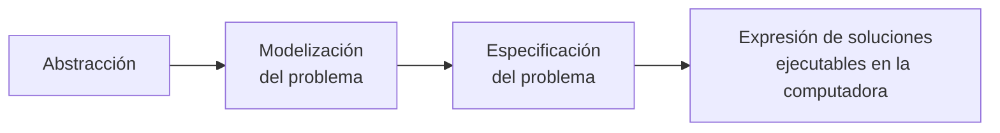
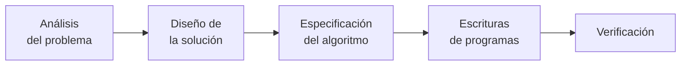

# programación - 2023

## Tabla de contenidos

1. [Unidad 0 - algoritmos](#algoritmos)
2. [Unidad 1 - programación](#programación)
3. [Unidad 2 - lenguajes de programación](#lenguajes-de-programación)

## Algoritmos

### ¿Qué es un algoritmo?

Un algoritmo es una descripción de la forma en la que se debe llevar a cabo una tarea o proceso, tiene una serie finita de pasos (Un comienzo y un fin).

El diseño del algoritmo se realiza usando PSEUDOCÓDIGO.

- Neutro: Es independiente al lenguaje a utilizar.
- Completo: Permite expresar cualquier idea computacional.

### Características del pseudocódigo

Cada algoritmo tiene:

- Un nombre que indica la tarea que resolverá
- Puede tener o no una entrada (Datos que necesitamos que el usuario ingrese)
- Tiene una salida (Datos que devuelve nuestro programa)
- Toda entrada se debe **LEER**. (Todos los datos "ingresados" por los usuarios se deben leer)
- Se puede asignar valores a las variables.
- Toda salida se debe **ESCRBIR**: (Todos los datos que obtenemos se deben "mostrar")
  \*Para indicar el final de un algoritmo, utilizamos **PARAR**

### Técnicas de diseño de algoritmos

- El proceso de adicionar más detalles a una solución de un problema se conoce como **REFINAMIENTO SUCESIVO.**

- El método **DIVIDE AND CONQUER** con la que se aborda un problema tiene la característica de ser una técnica **TOP-DOWN**. (Es una estrategia que permite descomponer un problema largo y complejo en subproblemas mas pequeños y fáciles de resolver).

#### Ejemplo:

La modalidad de pago de la factura de luz en una cierta ciudad es la siguiente: se establece una tarifa mensual para el consumo mínimo (hasta los 100 kwh) de $1200. Si se ha sobrepasado dicho consumo, se suma una tarifa de $125 por cada kwh adicional; pero si está vencida la factura, la tarifa que se usa ya no es de $125 sino de $210. Además en cualquier caso se hace un descuento del 5% al monto total, por pago de contado. Diseñe un algoritmo con niveles de refinamiento, que determine cuánto debe pagar cada cliente. Pruebe la misma para un número indefinido de clientes.

```
ALGORITMO: PAGO_LUZ
ENTRADAS:
  consumo: real,
  estaVencida: entero (0: no / 1: si),
  cliente: entero positivo,
  metodoDePago: entero (0: tarjeta / 1: contado),

SALIDA:
  importe: real

VAR. AUXILAR:
  excede: real

A1. LEER (cliente)
A2. calcular_importe
A3. PARAR
```

```
A2. calcular_importe
  MIENTRAS (cliente > 0)
    LEER(consumo, metodoDePago, estaVencida)

    SI (consumo <= 100) ENTONCES
      importe <- 1200
    SINO
      excede <- consumo - 100
      SI (estaVencida = 1) ENTONCES
        importe<- 1200 + excede * 210
      SINO
        importe<- 1200 + excede * 125
      FIN SI
    FIN SI

    SI (metodoDePago = 1) ENTONCES
      importe <- importe - (importe * 0.05)
    FIN SI

    ESCRIBIR (importe)
    LEER (cliente)
  FIN MIENTRAS
```

**[⬆ Volver arriba](#tabla-de-contenidos)**

## Programación

### El proceso de programación

- ¿Como se resuelve un problema del mundo real con una computadora?

- ¿Como se expresa la solución al problema planteado?

- ¿Como se reduce la complejidad de los problemas?

El programador debe realizar algunos procesos intelectuales.



#### Abstracción

Interpretar los aspectos esenciales de un problema y expresarlo en términos **precisos**.

#### Modelización del problema

Simplificar su expresión encontrando sus aspectos principales, los datos que se deben procesar y el contexto.

#### Especificación del problema real

Se deben determinar en forma clara y concreta el objetivo que se desea.

Por ejemplo el Algoritmo de la [unidad 0](./unidad_0.md)

```
ALGORITMO: PAGO_LUZ
ENTRADAS:
  consumo: real,
  estaVencida: entero (0: no / 1: si),
  cliente: entero positivo,
  metodoDePago: entero (0: tarjeta / 1: contado),

SALIDA:
  importe: real

VAR. AUXILAR:
  excede: real

A1. LEER (cliente)
A2. calcular_importe
A3. PARAR
```

```
A2. calcular_importe
  MIENTRAS (cliente > 0)
    LEER(consumo, metodoDePago, estaVencida)

    SI (consumo <= 100) ENTONCES
      importe <- 1200
    SINO
      excede <- consumo - 100
      SI (estaVencida = 1) ENTONCES
        importe<- 1200 + excede * 210
      SINO
        importe<- 1200 + excede * 125
      FIN SI
    FIN SI

    SI (metodoDePago = 1) ENTONCES
      importe <- importe - (importe * 0.05)
    FIN SI

    ESCRIBIR (importe)
    LEER (cliente)
  FIN MIENTRAS
```

#### Expresión de soluciones ejecutables en la PC

Realizar una solución ejecutable en una computadora usando un lenguaje de programación.

```C
/** Aqui se colocará la solución en lenguaje C*/
#include <stdio.h>

int main() {
  return 0
}
```

### Etapas de resolución de problemas



#### Análisis del problema

##### La importancia del contexto:

La definición del contexto es importante para analizar y diseñar la solución usando computadoras.

Impone restricciones y consideraciones.

#### Diseño de la solución

##### Descomposición - Modularización:

Se usará la metodología top-down (arriba-abajo) de descomposición de problemas para desarrollar el sistema de software.

Se obtendrán módulos que deberán estar ligados entre si para obtener la solución final.

#### Especificación del algoritmo

- Cada uno de los módulos deberá tener su propio algoritmo.

- La elección del algoritmo es importante, dado que de ella depende la eficiencia de la solución.

#### Escritura de programas

Un algoritmo es una especificación simbólica que debe convertirse a programa real sobre un lenguaje de programación concreto. (Ya sea C, pytho, JavaScript, etc.)

Programar no es lo mismo que codificar. La programación se trata de desarrollar una aplicación o máquina completa; mientras que la codificación trata de **traducir** un lenguaje a uno que una máquina pueda entender.

#### Verificación

Antes de dar por finalizada cualquier labor de programación, es fundamental preparar un conjunto de datos representativos del problema que permiten probar el programa cuando se ejecute, y así verificar los resultados. Para esto se realizan:

- Pruebas (testing)
- Depuración
- Alternativas de diseño y estilo.

> **Importante! :** Cuanto mas exhaustivas sean las pruebas, mayor seguridad se tendrá que el funcionamiento del programa es correcto, por lo tanto menor posibilidad de errores.

##### Verificación: Corrección, prueba y optimización

- **Los errores de ejecución:** Afectan la operación normal del programa. Son originados por el usuario (Proporcionar datos incorrectos, formato diferente al esperado, etc).

- **Errores de tipo logico:** Derivan de un mal diseño de los algoritmos, como ser: bucle infinito, resultados incorrectos, etc.

- **Errores de sintaxis:** Se generan por no cumplicar con las "normas" de escritura de un lenguaje, como ser: falta o mal uso de elementos separadores (comas(,), puntos y comas (;)) o incluso palabras mal escritas.

#### Documentación

Documentación interna:

- Tabulación en el código.
- Uso de los comentarios.

Documentación externa:

- Para el usuario.
- Para el programador.

### Conclusión

Un programador debe asociar inmediatamente el proceso de desarrollo de software con el proceso de refinamiento y abstracción que abarca desde el problema real hasta su solución algorítmica con un lenguaje de programación

**[⬆ Volver arriba](#tabla-de-contenidos)**

## Lenguajes de programación

### Definición de lenguaje

Es el sistema a través del cual el hombre comunica sus ideas, sentimientos, ya sea a través del habla, la escritura u otros signos.

### Lenguaje de programación

Un **Lenguaje de programación** es un lenguaje formal que proporciona una serie de instrucciones que permiten a un programador escribir secuencias de órdenes y algoritmos a modo de poder controlar el comportamiento físico y loógico de una computadora.

A todo este conjunto de órdenes y datos escritos mediante un lenguaje de programación, se le conoce como programa.

### Tipos de lenguajes

La máquina sólo entiende un lenguaje conocido como código binario o código máquina, consiste en ceros y unos. Es decir solo utiliza 0 y 1 para codificar cualquier acción.

**Existen dos tipos de lenguajes claramente diferenciados:**

- **Lenguaje de bajo nivel:** Son los más próximos a la arquitectura hardware.

- **Lenguaje de alto nivel:** Son aquellos que se encuentran más cercanos a los programadores y usuarios.

#### Lenguajes de bajo nivel 🤿:

Son lenguajes totalmente dependientes de la máquina, es decir que el programa que se realiza con este tipo de _lenguajes no se pueden migrar o utilizar en otras maquinas_.

Al estar prácticamente diseñados a medida del hardware, aprovechan al máximo las características del mismo.

Dentro de los lenguajes de bajo nivel se encuentran **El lenguaje maquina**, que consiste en combinaciones de 0's y 1;s para formar ordenes entendibles por el hardware de la máquina. Son mucho más rápidos, pero dificiles de manejar.

Por otro lado se encuentra el _Lenguaje ensamblador_, el cual es un derivado del lenguaje maquina y está formado por abreviaturas de letras y números llamados mnemotécnicos. Como ventaja respecto al código máquina es que los códigos fuentes son más cortos y los programas ocupan menos memoria. Pero al igual que antes, son dificiles de probar y mantener.

#### Lenguajes de alto nivel 🗻:

Son aquellos que se encuentran más cercanos al lenguaje natural que al lenguaje máquina. **_Se tratan de lenguajes independientes de la arquitectura del ordenador._** Por lo que un programa escrito en lenguajes de alto nivel se pueden migrar entre máquinas sin ningún problema.

También permiten al programador olvidarse del funcionamiento interno de la máquina, dado que solo necesitan un "traductor" que entienda el código fuente como las características de la máquina.

#### ¿Podemos llamar HTML como lenguaje de programación?

La respuesta es un retundo NO.

HTML es un lenguaje de etiquetas (tag) que comunican al navegador cuál es la información a mostrar por pantalla.
